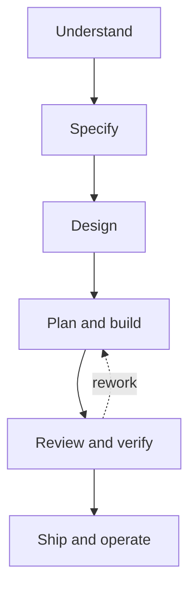
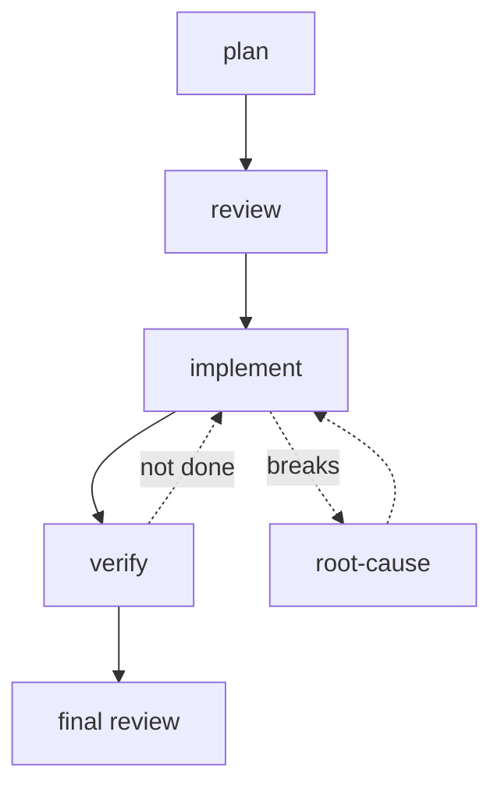

# My Claude Code Harness Setup ✴️

This repository is my personal [Claude Code](https://claude.com/claude-code) harness configuration, the contents of `~/.claude`: a curated skills library, a fleet of subagents, enforcement hooks, and the global behavioral rules that shape how the agent works across every project.

It is tuned for one operator, favoring strong conventions and hard guardrails over breadth. This README is the map; the `skills/`, `agents/`, and `hooks/` directories are the source of truth for what exists.

## How the skills fit together

The library mirrors the arc of building software. Skills auto-load when a task matches their description, so the right method shows up without being named.

The `orchestrate-delivery` skill walks this whole arc end to end for a substantial effort, invoking the right skill at each stage and stopping at the evidence gate between them; the individual skills still auto-load on their own for smaller work, and `analyze-product-metrics` closes the loop by measuring a launch against the spec's success metrics so the next cycle starts from evidence.

What the boxes do not show: specs and designs interrogate before they draft, built work is validated by actually running it (a real browser, real requests) because a green suite is necessary but never sufficient, and releases get a rollback plan but never auto-deploy to production. Around the arc sit data, document, and writing skills, plus a meta layer that maintains the library itself.

## The agent pipeline

Subagents run work in isolated context and report back. Each is a thin wrapper around a library skill, plus the overrides a subagent needs (decide-and-disclose instead of asking, return-only instead of acting) and read-only guardrails for anything that reviews.

A planner drafts the plan, a reviewer vets it, an implementer builds each task test-first, and a verifier confirms the work is done and actually wired in. Code and security reviewers do the final pass; a root-cause-investigator is the off-ramp when something breaks. Spec reviewers, a silent-failure auditor, and a deep-researcher are on-demand specialists.

## The enforcement layer

Hooks are the rules that cannot be talked out of: they fire deterministically on harness events, wired in `settings.json`. They surface project `AGENTS.md` context Claude Code would otherwise miss, gate verify-before-done (a turn that changes code without running a check is blocked at stop), block secrets and hook-bypass flags, scan ingested content for prompt injection, stop commands that hang the agent or burn API quota, and warn before the context window runs out.

## Where the rules live

Global behavioral rules live in `CLAUDE.md`; repository and directory conventions live in the `AGENTS.md` files. The `create-skill` skill is the authority on skill structure.
