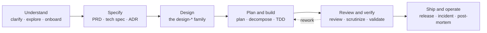
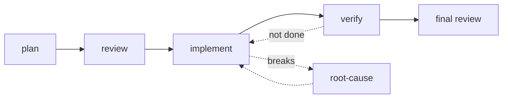

# My Claude Code Harness Setup ✴️

This repository is my personal [Claude Code](https://claude.com/claude-code) harness configuration: the contents of `~/.claude`. It holds a curated library of skills, a fleet of subagents, a handful of enforcement hooks, and the global behavioral instructions that shape how the agent works across every project.

It is tuned for one operator (me), so it favors strong conventions, hard guardrails, and high-signal automation over breadth. Most of it is portable; the personal parts (blog target, paths) are noted where they appear. This README is the map, not the index: the `skills/`, `agents/`, and `hooks/` directories are the source of truth for what exists.

## How the skills fit together

The library mirrors the arc of building software. Skills auto-load when a task matches their description, so the right method shows up at the right moment without being asked for by name.

A few things the arc enforces that the boxes do not show: specs and designs interrogate before they draft rather than guessing intent; built work is validated against reality by actually running it (a real browser, real API requests), because a green test suite is necessary but never sufficient; and releases are prepared with a rollback plan but never auto-deployed to production.

Around this arc sit data and document skills (tabular analysis, visualization, Office and PDF editing), writing and communication skills, and a meta layer that maintains the library itself. Each skill's `SKILL.md` is its own documentation.

## The agent pipeline

Subagents run work in isolated context and report back. Each is a thin wrapper: it preloads the relevant library skill, then adds the overrides a subagent needs (decide-and-disclose instead of asking the user, return-only instead of acting) plus hard read-only guardrails for anything that reviews.

A planner produces the plan, a plan-reviewer adversarially vets it, an implementer builds each task test-first, and a completion-verifier independently confirms the work is done and actually wired in. Code and security reviewers do the final pass, and a root-cause-investigator is the off-ramp when something breaks. Spec-stage reviewers, a silent-failure auditor, and a deep-researcher are on-demand specialists dispatched as needed. Definitions live in `agents/`.

## The enforcement layer

Hooks are the rules that cannot be talked out of: they fire deterministically on harness events, wired in `settings.json`. As a class they inject project `AGENTS.md` context that Claude Code would otherwise miss, block secrets and hook-bypass flags before they land, scan ingested file and web content for prompt injection, and stop a few commands that hang the agent or burn API quota. Each is documented in `hooks/AGENTS.md`.

## Where the rules live

Global behavioral rules that apply in every project live in `CLAUDE.md`. Repository and directory conventions live in the `AGENTS.md` files (root, `agents/`, `hooks/`). The authority on skill structure and conventions is the `create-skill` skill.
