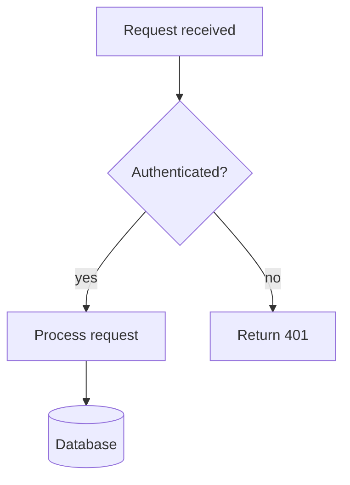
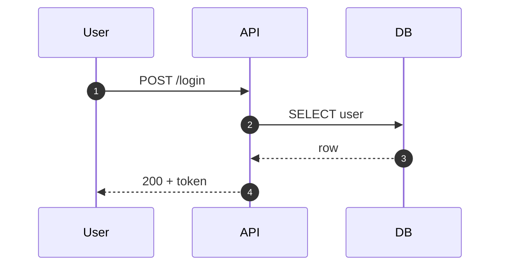
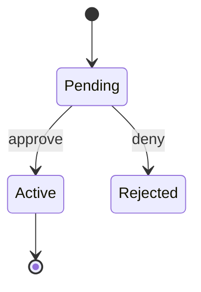
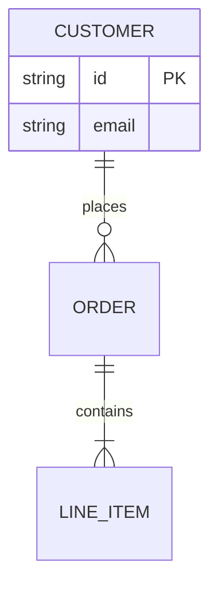

# Mermaid: Flowcharts, Sequence, State, ER, Class, Gantt, Git Graphs

Text-based diagrams rendered natively by GitHub, GitLab, and Obsidian inside fenced ` ```mermaid ` blocks, or rendered to image files with mermaid-cli.

## Contents

- Choosing the diagram type
- Delivery format
- Syntax rules and failure modes
- Type templates
- Rendering and validating

## Choosing the diagram type

| Need | Type declaration |
|---|---|
| Process, decision logic, dependencies | `flowchart TD` (top-down) or `flowchart LR` (left-right) |
| Interactions between actors over time | `sequenceDiagram` |
| States and transitions | `stateDiagram-v2` |
| Entities and relationships (data model) | `erDiagram` |
| Classes and inheritance | `classDiagram` |
| Schedule with phases | `gantt` |
| Branching strategy | `gitGraph` |
| Hierarchical brainstorm | `mindmap` |

Direction choice matters: long sequential processes read better LR; hierarchies and decision trees read better TD. Pick the direction that fits the content's natural axis, not the default.

## Delivery format

- Destination is a Markdown file (README, docs, Obsidian vault): deliver a fenced ` ```mermaid ` block in place. The renderer is the destination platform; an image file would be uneditable and undiffable.
- Destination is a standalone artifact (slide, ticket attachment, image request): render to SVG or PNG with mermaid-cli (below).
- Either way, validate or render locally before delivering when tooling exists; a syntax error discovered by the reader on GitHub is the failure this skill exists to prevent.

## Syntax rules and failure modes

- **Quote labels containing special characters.** Parentheses, brackets, colons, and quotes inside node text break parsing: `A["calls fetch() and retries"]`, not `A[calls fetch() and retries]`.
- **The word `end` in lowercase breaks flowcharts and sequence blocks.** As node text, write `"end"` quoted or capitalize (`End`); bare `end` terminates a block early.
- **Node IDs are not labels.** `A[Login Page]` declares ID `A` with label `Login Page`; reuse the ID, not the label, for further edges. Reusing a label string creates duplicate nodes silently.
- **One statement per line.** Mermaid is line-oriented; do not pack multiple edges on one line with semicolons in generated output, because it makes diffs and error line numbers useless.
- **Comments are `%%`**, not `//` or `#`.
- **`stateDiagram-v2`, not `stateDiagram`.** The v1 parser is legacy and renders inconsistently across platforms.
- **Keep theme directives out of committed Markdown** unless the destination supports them; `%%{init: ...}%%` blocks render as text on platforms with strict configs. Default theming is the safe choice for GitHub.

## Type templates

Flowchart:



Sequence (use `autonumber` when steps are referenced in prose; `->>` solid call, `-->>` dashed reply):



State:



ER (crow's foot: `||` exactly one, `o{` zero or more, `|{` one or more):



## Rendering and validating

Write the source to a `.mmd` file, then in order:

1. **Render if tooling exists:**

```shell
npx -y @mermaid-js/mermaid-cli -i diagram.mmd -o diagram.svg
```

PNG output: `-o diagram.png` (add `-s 2` for 2x scale; raster output at default scale is blurry in docs). The first run downloads a headless Chromium; that one-time download is slow and is not a hang.

2. **If `npx` is unavailable**, attempt one install: `npm install -g @mermaid-js/mermaid-cli`. Do not retry on failure; a second attempt will not succeed where the first failed and burns time.

3. **If rendering is still unavailable**, deliver the fenced block and say explicitly: validated by review against the rules above, not render-verified. Do not silently skip the disclosure; the reader needs to know the verification level.

A render that exits 0 and produces the file proves the syntax. Then open the image with the Read tool and check the layout communicates: edge crossings, label collisions, and a wrong direction are fix-and-re-render findings.
