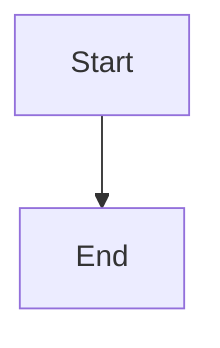
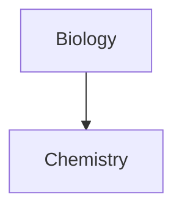

Obsidian rich-content syntax. Load when writing highlights, comments, footnotes, task lists, tables with embedded links, Mermaid diagrams, LaTeX math, or HTML. The SKILL.md Essentials cover the common cases; this file is the complete catalog.

## Contents

- [Obsidian-specific formatting](#obsidian-specific-formatting)
- [Tables](#tables)
- [Mermaid diagrams](#mermaid-diagrams)
- [Math (LaTeX / MathJax)](#math-latex--mathjax)
- [HTML usage](#html-usage)

## Obsidian-specific formatting

**Highlights:**

```md
==This text is highlighted.==
```

**Comments** (visible in editing view only, hidden in reading view and exports):

```md
This is an %%inline%% comment.

%%
This is a block comment.
It can span multiple lines.
%%
```

**Strikethrough:** `~~striked out~~`

**Task lists with custom statuses:**

```md
- [x] Completed
- [ ] Incomplete
- [?] Uncertain
- [-] Cancelled
```

**Footnotes:**

```md
Here is a reference[^1] and another[^note].

[^1]: The footnote text.
[^note]: Named footnotes render as numbers but are easier to manage.
```

Inline footnotes (reading view only):

```md
This sentence has an inline footnote.^[The footnote content goes here.]
```

**Escaping Markdown syntax**: prefix the character with `\`:

```md
\*not italic\*
\#not a heading
\|not a table separator
1\. not a list item
```

## Tables

Standard GFM table syntax with optional column alignment:

```md
| Left | Center | Right |
| :--- | :----: | ----: |
| A    |   B    |     C |
```

When using wikilinks or image resize syntax inside a table cell, escape the pipe with `\|`:

```md
| Column |
| --- |
| [[Note Name\|Display Text]] |
| ![[image.jpg\|200]] |
```

## Mermaid diagrams

Wrap Mermaid syntax in a fenced code block tagged `mermaid`:

````md

````

To make diagram nodes into internal links, attach the `internal-link` class:

````md

````

Note: internal links from Mermaid diagrams do not appear in the Graph view.

## Math (LaTeX / MathJax)

**Block math:**

```md
$$
\begin{vmatrix}a & b\\
c & d
\end{vmatrix}=ad-bc
$$
```

**Inline math:**

```md
This is an inline expression $e^{2i\pi} = 1$.
```

## HTML usage

Obsidian sanitizes HTML. `<script>` tags are stripped. Safe HTML elements include: `<u>`, `<s>`, `<span>`, `<div>`, `<iframe>`, `<table>`, `<br>`, `<hr>`, and HTML comments.

```html
<u>underlined text</u>
<s>strikethrough</s>
<span style="font-family: cursive">custom font</span>
<!-- This is an HTML comment, also visible as a hidden comment -->
```

**Critical limitations:**
- Markdown syntax inside HTML blocks is **not** rendered. `<div>**bold**</div>` will not produce bold text.
- HTML blocks must be self-contained. Blank lines within an HTML block break it.

```html
<!-- This works -->
<table>
<tr><td>Content</td></tr>
</table>

<!-- This does NOT work: blank lines break the block -->
<table>

<tr>

<td>Content</td>

</tr>

</table>
```

Use HTML for: underline, custom spans with CSS classes, iframes, and HTML comments as an alternative to `%%` comments when exporting via Pandoc.
